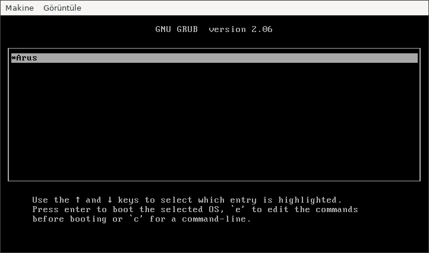
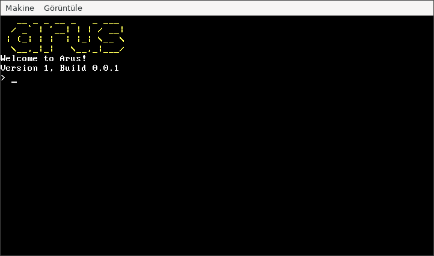
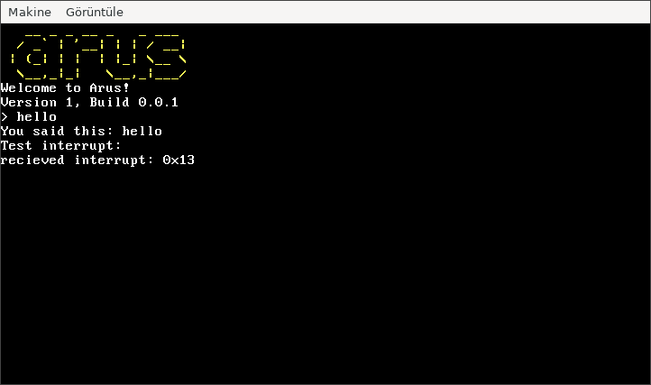

# Arus
<p align="center">
<br/>
A modern and user-friendly operating system written in C++
<a href="https://discord.gg/t3T9NkHWsW"></a>
<a href="https://github.com/ardatdev/arus"></a>
</p>

## Compiling
You need `grub`, `i686-elf-tools` and `nasm` installed.
```sh
cd src
make build
```

## Running
You need qemu installed.
```sh
make run
```

## Screenshots
Note: These screenshots may not be up to date.




